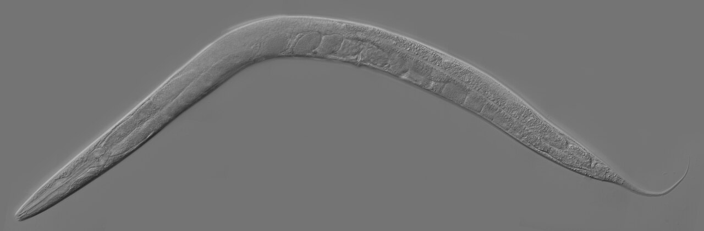
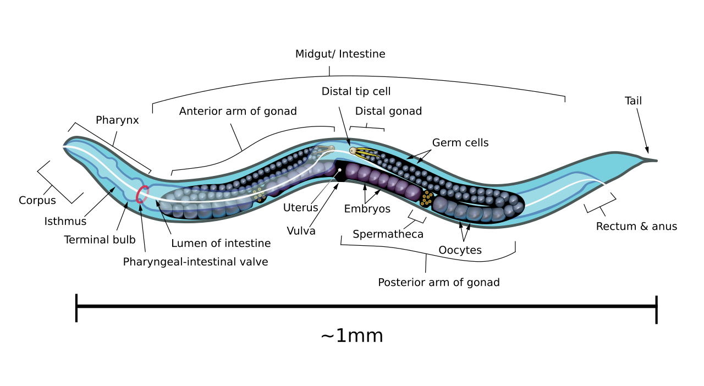
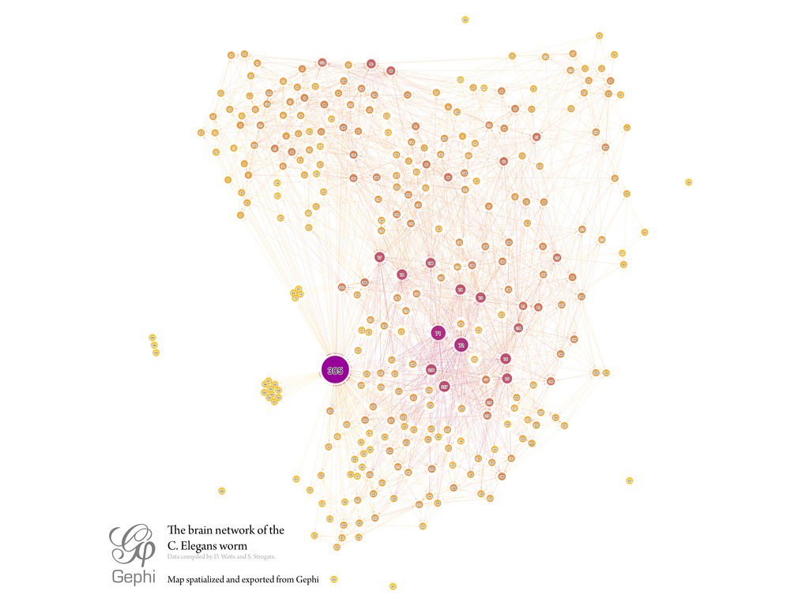
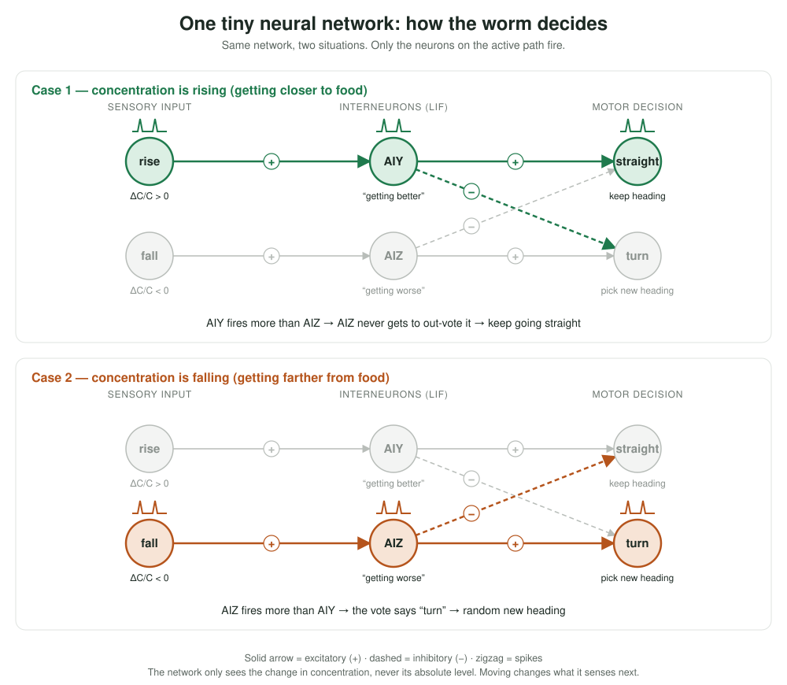
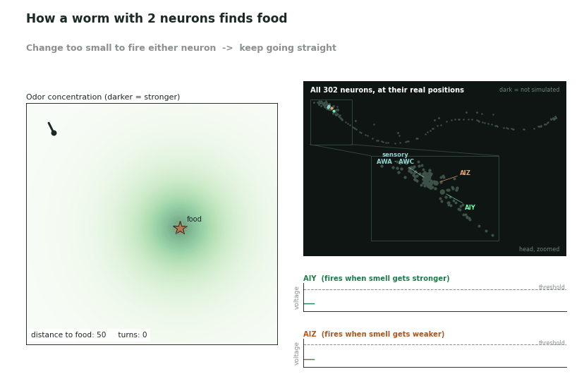
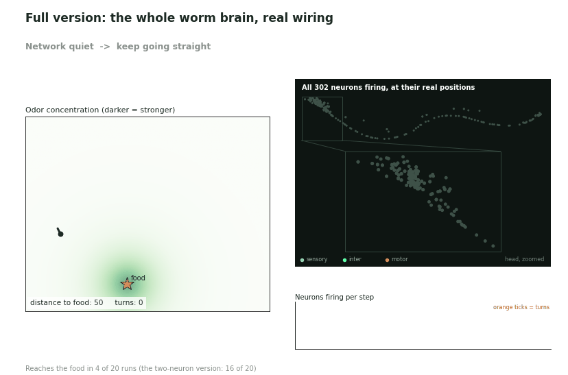

# C. elegans Neural Simulation

A from-scratch, minimal simulation of *C. elegans* chemotaxis (its odor-following
behaviour), built up from a single simulated neuron to a small circuit that
reproduces the closed-loop mechanism the animal actually uses to find food.

*C. elegans* is the standard entry point for this kind of work because it is
the only animal whose complete nervous system has been mapped: just 302
neurons, with every synapse catalogued (White et al., 1986; digitized by the
[OpenWorm](https://openworm.org/) project). That makes it small enough to
reason about by hand, while still being a real, complete, behaving nervous
system — not a toy.

## What the worm actually looks like



*An adult C. elegans under a microscope: about 1 mm long, transparent and
unsegmented (photo by Kbradnam,
[CC BY-SA 2.5](https://creativecommons.org/licenses/by-sa/2.5/),
[via Wikimedia Commons](https://commons.wikimedia.org/wiki/File:Adult_Caenorhabditis_elegans.jpg)).*



*Labelled anatomy of an adult hermaphrodite. The head is on the left,
with the pharynx (feeding organ); the diagram shows the gut and reproductive
organs, not the neurons (diagram by KDS444,
[CC BY-SA 3.0](https://creativecommons.org/licenses/by-sa/3.0/),
[via Wikimedia Commons](https://commons.wikimedia.org/wiki/File:Caenorhabditis_elegans_hermaphrodite_adult-en.svg)).*

## Four layers of "simulating a nervous system"

Any nervous-system simulation, biological or not, is built from the same four
layers. This project implements exactly these four, in order.

### Layer 1 — How a single neuron is simplified into a math model

This is the most basic choice: how simple, or how biologically faithful, should
the model of "one neuron" be?

**Simplest: McCulloch-Pitts neuron (1943, the first formal neuron model)**
- Every input is multiplied by a weight, summed, and compared to a threshold:
  above it, the neuron "fires" (output 1); otherwise it doesn't (output 0).
- Entirely binary, with no concept of time — just a weighted sum and a
  comparison.
- Pro: extremely simple, makes "weight" and "activation" easy to grasp. Con:
  throws away the one thing a real neuron's voltage actually does — change
  continuously over time.

**Middle ground: Leaky Integrate-and-Fire (LIF)**
- The neuron has a membrane potential that **accumulates** input over time,
  but also **leaks** back toward a resting value when there's no input (hence
  "leaky").
- Once the potential crosses a threshold, it "fires" (produces a spike), then
  resets and enters a brief refractory period.
- This is the most widely used "realistic enough, simple enough" compromise
  in computational neuroscience — it keeps the two biologically essential
  features (time and discrete spikes) without the heavy differential
  equations of a Hodgkin-Huxley model.

**Most realistic: Hodgkin-Huxley model (1952, Nobel Prize-winning work)**
- A set of coupled differential equations that precisely describe how ion
  channels (sodium, potassium) open and close and how current flows,
  reproducing a real neuron's voltage waveform with high accuracy.
- Very precise but computationally heavy — generally only needed when you
  actually care about the exact shape of the membrane-potential waveform
  (e.g. pharmacology research). Overkill for simulating an entire 302-neuron
  connectome.

This repo uses the **LIF model** ([`src/lif_neuron.py`](src/lif_neuron.py)) —
the standard middle-ground choice for circuit-level simulation.

### Layer 2 — Wiring neurons together: the Connectome

Once you've picked a single-neuron model, the second layer is **topology**:
who is connected to whom, how strong each connection is (weight), and whether
it's excitatory or inhibitory. This layer is, in essence, a **weighted
directed graph**:

- Nodes = neurons
- Edges = synapses, each with a weight (positive = excitatory, negative =
  inhibitory) and a direction

*C. elegans* is special precisely because it is **the only animal whose full
connectome has actually been measured** — traced by hand from electron
micrograph slices (White et al., 1986), later digitized by OpenWorm.



*The measured C. elegans wiring diagram drawn as a network: each dot is a
neuron and each line a synapse (data compiled by D. Watts and S. Strogatz from
White et al., 1986; layout by Mentatseb using Gephi,
[CC BY-SA 3.0](https://creativecommons.org/licenses/by-sa/3.0/),
[via Wikimedia Commons](https://commons.wikimedia.org/wiki/File:C.elegans-brain-network.jpg)).
The circuit simulated in this repo is a tiny slice of this graph.*

The significance: however simple the single-neuron model is, once the
connectome is fixed, "what the network does" is no longer something you get
to design freely — it's constrained by real biological measurement.

### Layer 3 — Running the simulation: discrete time-stepping

With a neuron model and a connectome, the simulation itself is just a loop:

```text
for each time step:
    for each neuron:
        collect the outputs of all its upstream neurons (per the connectome)
          from the previous step
        sum them, weighted, as this step's input
        update this neuron's state using the model chosen in Layer 1 (e.g. LIF)
    record every neuron's state for this step, then advance
```

This is why this layer barely depends on which organism you're simulating —
fruit fly or roundworm, the simulation loop has the same shape; only the
connectome's topology and each neuron's parameters differ.

### Layer 4 — From neural activity to behaviour: motor neurons → muscles

The final layer translates "some neurons fired" into "the body moved":

- Sensory neurons (e.g. the worm's head chemoreceptors) receive environmental
  input (food concentration).
- Interneurons process and integrate that signal.
- Motor neurons fire → drive muscle contraction → the body bends / changes
  heading.

**The *C. elegans* chemotaxis circuit is the cleanest complete example of all
four layers together**: roughly a dozen neurons (AWA/AWC sensing odor,
AIY/AIZ integrating and deciding whether to keep going straight or turn) form
a complete closed loop from "smelling food" to "swimming toward it." Small
enough to sketch the whole connection diagram on paper, yet a real, complete,
self-consistent explanation of behaviour — which is why it's the standard
first example for learning to simulate a nervous system.

---

## How the whole worm works — one small neural network

The chemotaxis circuit is a tiny neural network: two sensory inputs, two
interneurons, two motor outputs. The picture below shows the same network in
the two situations it can be in. Only the neurons on the active path fire.



**How the network works:**

1. **The input is a change, not a level.** The two sensory channels carry the
   fractional change in concentration since the last step: `rise` is active
   when it went up, `fall` when it went down. Neither ever sees "how strong is
   the smell here."
2. **Each channel drives one LIF interneuron.** `rise` → AIY and `fall` → AIZ.
   Each interneuron accumulates its input, leaks, and spikes once its membrane
   potential crosses threshold (Layer 1). A stronger change means more spikes.
3. **The two interneurons compete.** AIY excites "straight" and inhibits
   "turn"; AIZ does the reverse. In the code the outcome is a spike-count
   vote: the worm turns only if AIZ out-spikes AIY, and a tie or silence
   means "keep going."
4. **Moving closes the loop.** The chosen action changes the worm's position,
   which changes the concentration it senses next step, which feeds back into
   the two sensory inputs. There is no "done" state, and with no map and no
   memory of coordinates a handful of neurons still climbs the gradient.

The picture follows the real pathway at the level of cell types (AWA/AWC
sensory neurons → AIY/AIZ interneurons → motor neurons), but the clean split
"rising → AIY, falling → AIZ" is a modelling simplification, not the measured
wiring. In OpenWorm's copy of the connectome, AWC connects strongly to AIY
(22 synapses) while AWA connects strongly to AIZ (23–25), and AIY also
synapses onto AIZ (about 70). Real chemotaxis also involves weathervaning
(curving toward higher concentration, not just turn/no-turn) and more
interneurons (AIB, RIA) than shown here.

## Watching it forage



*Left: the worm's path through the odor field; orange dots mark the turns.
Top right: all 302 neurons drawn at their real positions in the body (upper
strip: the whole worm; lower box: a zoom on the head, where most of them sit),
in the style of the neuron-by-neuron views used for whole-brain fly
simulations. Only a handful light up, because only a handful are simulated:
the AIY and AIZ interneurons, which glow when their LIF neuron spikes, and the
AWA/AWC sensory neurons, which glow with the size of the sensed change in
smell. The other 294 stay dark. Below that: the two interneurons' membrane
potentials. While the smell gets stronger AIY fires steadily and the worm
keeps going straight; each time it gets weaker AIZ fires and the worm picks a
new heading. In this run it
starts 50 units from the food and reaches it after about 700 steps and 20
turns, with no map and no memory of where it has been. Once it is within 2
units of the food it counts as eaten and stops. That stop rule lives in the
simulation loop, not in the neurons: the circuit only ever asks "better or
worse than a moment ago", so on its own it would keep wandering around the
food. It is a biased random walk, so a given run can take longer (or, with an
unlucky seed, not arrive within the step limit).*

## Step 2: the full version — all 302 neurons

The simple version wires two neurons by hand. The full version keeps the same
worm, odor field and closed loop, and replaces the two-neuron circuit with the
whole measured connectome: every one of the 302 neurons as a LIF neuron, joined
by every synapse and gap junction that has been counted in the real worm.



*Every neuron lights up when it fires (blue = sensory, green = interneuron,
orange = motor). The odor is fed only to the AWA and AWC sensory neurons; the
worm turns when the backward command neurons (AVA, AVD, AVE) fire more than the
forward ones (AVB, PVC). The trace under the neuron panel counts how many
neurons fired on each step, with a tick for every turn.*

**It works much worse than the simple version, and that is the point.**
Over 20 random starting headings (1500 steps each), the worm reaches the food:

| Circuit | Reaches the food |
|---|---|
| Simple two-neuron circuit | 16 of 20 |
| Full connectome (302 neurons) | 4 of 20 |
| Control: turns at random, ignores the odor | 0 to 5 of 20 |

So the raw connectome does respond to the odor, but only a little better than
chance. Two things go wrong, and both are visible in the GIF:

- **The network is hard to keep in a useful state.** The connectome tells us
  how many synapses connect each pair of neurons, not how strong they are. With
  synapses too weak the signal never leaves the sensory neurons; slightly too
  strong and nearly every neuron fires whatever the input is, like a seizure.
  The strength used here (`SYNAPSE_SCALE`) is the one free number, set just
  below that runaway point.
- **Activity reverberates instead of following the odor.** A stretch of
  "getting weaker" recruits more and more of the network, and that activity
  keeps going for 25+ steps after the smell starts getting stronger, so the
  worm keeps turning when it should not. Only the GABA neurons are treated as
  inhibitory, which is too little braking. A global inhibition term did not fix
  it.

What is missing is exactly what a wiring diagram does not contain: for every
synapse, whether it excites or inhibits, and how strongly. (Many glutamate
synapses inhibit in the real worm, for example.) In the simple version those
signs and strengths are set by hand, which is why it climbs the gradient. That
gap between a connectome and a working circuit is the main lesson of this step.

The assumptions behind the full version are listed at the top of
[`src/full_chemotaxis.py`](src/full_chemotaxis.py) and
[`src/connectome.py`](src/connectome.py).

## Code in this repo

- **[`src/lif_neuron.py`](src/lif_neuron.py)** — the Layer 1 building block: a
  single Leaky Integrate-and-Fire neuron, with a runnable demo showing how its
  membrane potential accumulates, leaks, and fires under different input
  currents.
- **[`src/chemotaxis_circuit.py`](src/chemotaxis_circuit.py)** — the full
  Layer 2–4 loop from the diagram above: a simulated worm moving through a
  concentration field, with two LIF interneurons (`AIY`/`AIZ`) that read the
  rate of change in sensed concentration and decide whether to keep going
  straight or turn, closing the loop step by step.
- **[`src/make_gif.py`](src/make_gif.py)** — replays that simulation as the
  animated GIF above and saves it to [`output_results/`](output_results/).

The full version (step 2):

- **[`src/connectome.py`](src/connectome.py)** — loads the real connectome as
  two 302 × 302 matrices (chemical synapses, with a sign, and gap junctions).
- **[`src/lif_population.py`](src/lif_population.py)** — the same LIF neuron as
  `lif_neuron.py`, vectorised so all 302 can be stepped at once. Running it
  checks that it matches `LIFNeuron` exactly.
- **[`src/full_chemotaxis.py`](src/full_chemotaxis.py)** — the closed loop with
  the whole connectome as the circuit, and a written account of what is real,
  what is assumed, and how well it works.
- **[`src/make_full_gif.py`](src/make_full_gif.py)** — renders the GIF above.

Data:

- **[`data/neuron_positions.csv`](data/neuron_positions.csv)** — the position
  of each of the 302 neuron cell bodies (micrometres, head at negative y),
  extracted from the per-neuron morphology files of OpenWorm's
  [CElegansNeuroML](https://github.com/openworm/CElegansNeuroML) project. Used
  to draw the neuron panels in the GIFs.
- **[`data/connectome_edges.csv`](data/connectome_edges.csv)** — the synapses
  between those 302 neurons (chemical synapses and gap junctions, with the
  number counted for each pair), from the edge list in OpenWorm's
  [c302](https://github.com/openworm/c302) project (MIT license) with neuron
  names matched to the position file. Synapses onto muscles are left out.

### Running

The two simple-version scripts are pure Python (no dependencies) and print a
text/ASCII summary of what happened:

```bash
python src/lif_neuron.py
python src/chemotaxis_circuit.py
```

The full version and the animations need extra packages:

```bash
pip install numpy matplotlib pillow
python src/full_chemotaxis.py     # the whole connectome, text summary
python src/make_gif.py            # writes output_results/chemotaxis.gif
python src/make_full_gif.py       # writes output_results/full_connectome.gif
```
