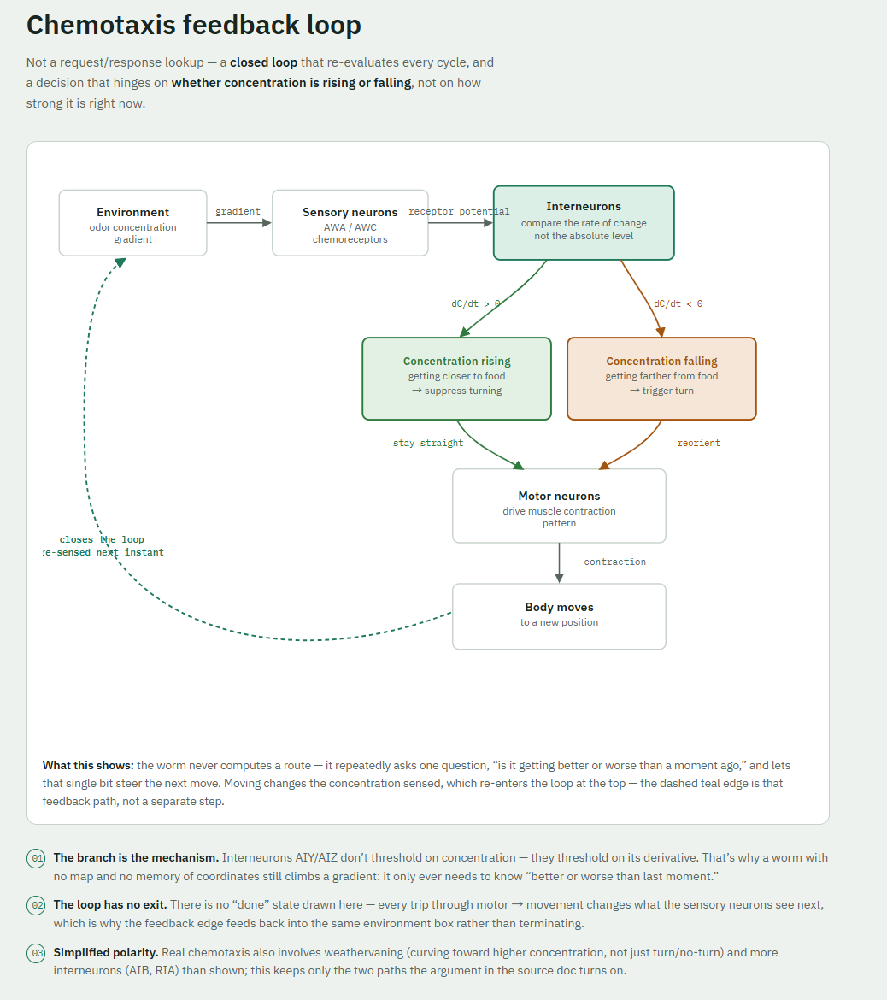

# C. elegans Neural Simulation

A from-scratch, minimal simulation of *C. elegans* chemotaxis (its odor-following
behaviour), built up from a single simulated neuron to a small circuit that
reproduces the closed-loop mechanism the animal actually uses to find food.

*C. elegans* is the standard entry point for this kind of work because it is
the only animal whose complete nervous system has been mapped: just 302
neurons, with every synapse catalogued (White et al., 1986; digitized by the
[OpenWorm](https://openworm.org/) project). That makes it small enough to
reason about by hand, while still being a real, complete, behaving nervous
system — not a toy.

## Four layers of "simulating a nervous system"

Any nervous-system simulation, biological or not, is built from the same four
layers. This project implements exactly these four, in order.

### Layer 1 — How a single neuron is simplified into a math model

This is the most basic choice: how simple, or how biologically faithful, should
the model of "one neuron" be?

**Simplest: McCulloch-Pitts neuron (1943, the first formal neuron model)**
- Every input is multiplied by a weight, summed, and compared to a threshold:
  above it, the neuron "fires" (output 1); otherwise it doesn't (output 0).
- Entirely binary, with no concept of time — just a weighted sum and a
  comparison.
- Pro: extremely simple, makes "weight" and "activation" easy to grasp. Con:
  throws away the one thing a real neuron's voltage actually does — change
  continuously over time.

**Middle ground: Leaky Integrate-and-Fire (LIF)**
- The neuron has a membrane potential that **accumulates** input over time,
  but also **leaks** back toward a resting value when there's no input (hence
  "leaky").
- Once the potential crosses a threshold, it "fires" (produces a spike), then
  resets and enters a brief refractory period.
- This is the most widely used "realistic enough, simple enough" compromise
  in computational neuroscience — it keeps the two biologically essential
  features (time and discrete spikes) without the heavy differential
  equations of a Hodgkin-Huxley model.

**Most realistic: Hodgkin-Huxley model (1952, Nobel Prize-winning work)**
- A set of coupled differential equations that precisely describe how ion
  channels (sodium, potassium) open and close and how current flows,
  reproducing a real neuron's voltage waveform with high accuracy.
- Very precise but computationally heavy — generally only needed when you
  actually care about the exact shape of the membrane-potential waveform
  (e.g. pharmacology research). Overkill for simulating an entire 302-neuron
  connectome.

This repo uses the **LIF model** ([`src/lif_neuron.py`](src/lif_neuron.py)) —
the standard middle-ground choice for circuit-level simulation.

### Layer 2 — Wiring neurons together: the Connectome

Once you've picked a single-neuron model, the second layer is **topology**:
who is connected to whom, how strong each connection is (weight), and whether
it's excitatory or inhibitory. This layer is, in essence, a **weighted
directed graph**:

- Nodes = neurons
- Edges = synapses, each with a weight (positive = excitatory, negative =
  inhibitory) and a direction

*C. elegans* is special precisely because it is **the only animal whose full
connectome has actually been measured** — traced by hand from electron
micrograph slices (White et al., 1986), later digitized by OpenWorm.

The significance: however simple the single-neuron model is, once the
connectome is fixed, "what the network does" is no longer something you get
to design freely — it's constrained by real biological measurement.

### Layer 3 — Running the simulation: discrete time-stepping

With a neuron model and a connectome, the simulation itself is just a loop:

```text
for each time step:
    for each neuron:
        collect the outputs of all its upstream neurons (per the connectome)
          from the previous step
        sum them, weighted, as this step's input
        update this neuron's state using the model chosen in Layer 1 (e.g. LIF)
    record every neuron's state for this step, then advance
```

This is why this layer barely depends on which organism you're simulating —
fruit fly or roundworm, the simulation loop has the same shape; only the
connectome's topology and each neuron's parameters differ.

### Layer 4 — From neural activity to behaviour: motor neurons → muscles

The final layer translates "some neurons fired" into "the body moved":

- Sensory neurons (e.g. the worm's head chemoreceptors) receive environmental
  input (food concentration).
- Interneurons process and integrate that signal.
- Motor neurons fire → drive muscle contraction → the body bends / changes
  heading.

**The *C. elegans* chemotaxis circuit is the cleanest complete example of all
four layers together**: roughly a dozen neurons (AWA/AWC sensing odor,
AIY/AIZ integrating and deciding whether to keep going straight or turn) form
a complete closed loop from "smelling food" to "swimming toward it." Small
enough to sketch the whole connection diagram on paper, yet a real, complete,
self-consistent explanation of behaviour — which is why it's the standard
first example for learning to simulate a nervous system.

---

## How the whole worm works — one diagram

The diagram below draws the full closed loop: **body senses environment →
neural processing → produces an action → the action changes the environment →
gets sensed again.** It's a picture of Layer 4 (the chemotaxis circuit), and
the most direct way to see "how the worm works."



**What this diagram is actually saying:**

1. **This is a closed loop, not a one-shot input → output.** The worm doesn't
   "compute where the food is and beeline for it" — at every step it re-senses
   and re-adjusts, closing in on the food source through **continuous probing
   and feedback correction**. This matches the earlier point directly: it's
   not graph search, it's a continuous reaction loop.
2. **The interneurons compare a rate of change, not an absolute value.** This
   is the key, counter-intuitive detail in chemotaxis: the worm decides
   whether to turn based on "is the concentration getting worse," not "is the
   concentration high enough." This is also exactly why a handful of neurons,
   with no map and no memory of coordinates, can still find a food source.
3. **Every arrow corresponds to a real synaptic connection in the
   connectome.** This diagram isn't a loose metaphor — connections like
   AWA→AIY and AWC→AIZ are real synapses backed by the measured data in White
   et al., 1986.

If you're about to write a simulation, this diagram is essentially your spec:
a handful of sensory-neuron nodes, a handful of interneuron nodes, a handful
of motor-neuron nodes — implement each with the LIF model above, wire them up
along the arrows, add a simple "concentration field" to stand in for the
environment, and that's a complete, minimal simulation.

## Code in this repo

- **[`src/lif_neuron.py`](src/lif_neuron.py)** — the Layer 1 building block: a
  single Leaky Integrate-and-Fire neuron, with a runnable demo showing how its
  membrane potential accumulates, leaks, and fires under different input
  currents.
- **[`src/chemotaxis_circuit.py`](src/chemotaxis_circuit.py)** — the full
  Layer 2–4 loop from the diagram above: a simulated worm moving through a
  concentration field, with two LIF interneurons (`AIY`/`AIZ`) that read the
  rate of change in sensed concentration and decide whether to keep going
  straight or turn, closing the loop step by step.

### Running

Both scripts are pure Python (no dependencies) and print a text/ASCII summary
of what happened:

```bash
python src/lif_neuron.py
python src/chemotaxis_circuit.py
```
